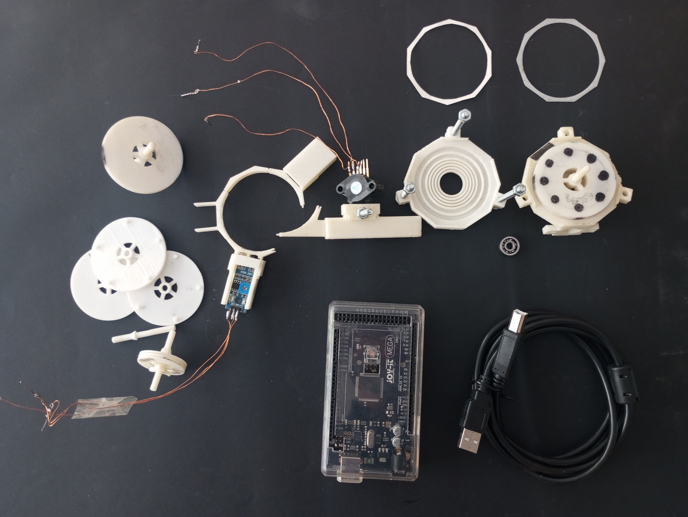
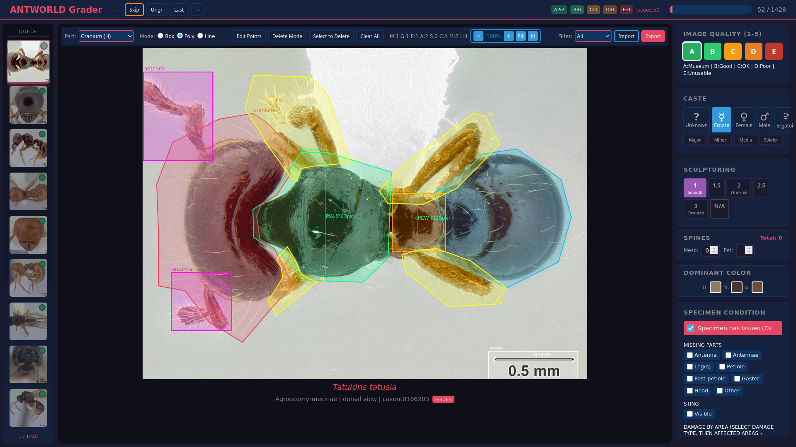
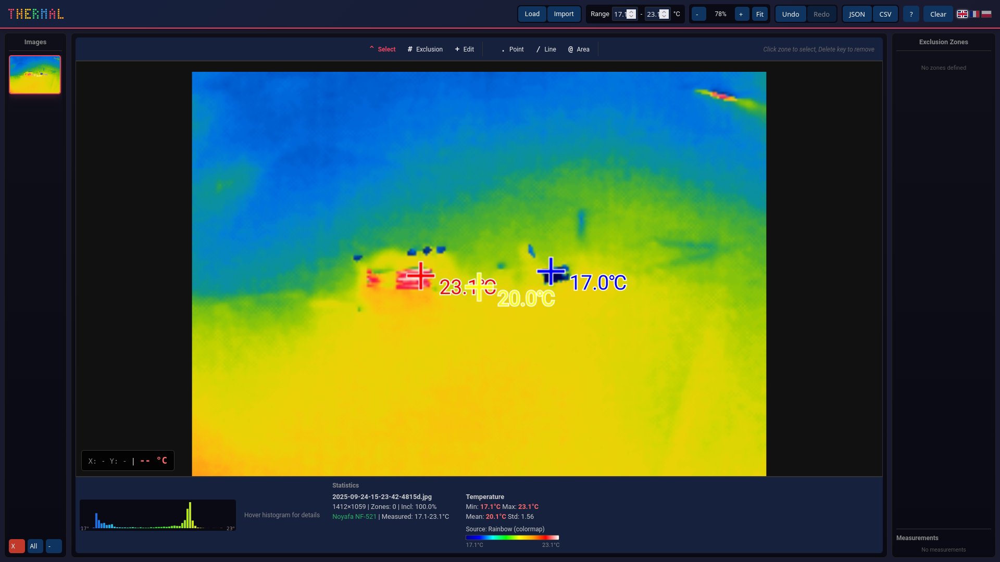
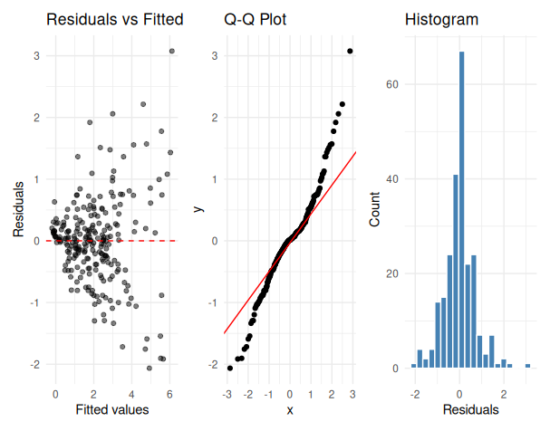

# Mr Georges

Mathematics, ants, machines and electronics.

I am `Tanngrisnirr` on GitHub (note the double r at the end; one-r `Tanngrisnir` is a different person). This page lists what I publish, where the source lives, and where to reach me.

## What I publish

### [ArduinoLAB](https://github.com/Tanngrisnirr/ArduinoLAB)

Three Arduino sketches that share one bench so ambient air, rotor speed and volumetric flow can be logged together during a bladeless Tesla turbine experiment.

The repo carries three companion sketches written in Arduino C++: a Bosch BME280 ambient-conditions logger (pressure, temperature, humidity), a reflective IR tachometer with two probe channels for benchmarking a baseline rotor against a modified one, and a Freescale MPX5010DP differential-pressure Venturi flowmeter. Every project follows the same skeleton (`<Name>.ino`, `README.md`, `docs/img`, `docs/materials.md`, optional `docs/theory.md` and `docs/datasheets/`), so jumping between them is friction-free.

### [ANTWORLD](https://github.com/Tanngrisnirr/ANTWORLD)

Identifies ant species from photographs using both human-written dichotomous keys (70+ keys, 936+ species) and a TensorFlow model trained on curated specimens.

ANTWORLD is an open identification platform built around two complementary engines. Human-authored DELTA keys cover the morphology-based path that taxonomists already use; the vision model handles the photograph-only path used by field collectors. An internal Grader tool (shown above) is what curates the training data: every specimen image gets quality scores and annotated body regions before it is allowed into the training set.

### [thermal-vegetation-monitoring](https://github.com/Tanngrisnirr/thermal-vegetation-monitoring)

Extracts temperature time series from thermal images of plants, after correcting for the calibration limits of a consumer Noyafa NF-521 camera.

The repo pairs a Python toolkit with a small browser-based GUI (THERMAL, shown above). Polygon exclusion zones mask out non-vegetation regions; per-zone temperature time series are exported to JSON or CSV for downstream analysis. The motivation is practical: field-grade thermal cameras are costly, and consumer units like the NF-521 produce useful data once their calibration drift and colormap quirks are accounted for in software.

### [grasslandDrought](https://github.com/Tanngrisnirr/grasslandDrought)

Wraps the Picon-Cochard et al. (2021) procedure so a grassland drought-tolerance experiment can be analyzed with one function call instead of hand-written `nlme::lme` formulas.

`grasslandDrought` is an R package that imports UREP-format Excel datasets, derives relative soil water content (RSWC) and climatic water balance (P-PET), runs nested mixed-effects models with `nlme::lme`, computes pairwise treatment contrasts via `emmeans`, and exports structured JSON results. The `analyze_treatment()` function does the full pipeline for a chosen response variable in one call; the diagnostic panels above are produced automatically and let the experimenter sanity-check the model assumptions before reading the inferential output.

### [Tanngrisnirr.r-universe.dev](https://github.com/Tanngrisnirr/Tanngrisnirr.r-universe.dev)

Distributes my R packages as a single registry so installers do not have to wait for the CRAN release cycle.

This repo is the metadata side of an [r-universe](https://r-universe.dev) registry. Once an `install.packages()` user adds `https://tanngrisnirr.r-universe.dev` as a repos entry, they can install development snapshots of my R packages (currently `grasslandDrought`) without going through CRAN's review cadence.

### Forks I track

Mirrors of upstream projects I rely on, kept in sync so my own work has stable inputs.

- **[antweb](https://github.com/Tanngrisnirr/antweb)**: fork of the AntWeb specimen database, used as an upstream data source for ANTWORLD.
- **[GAGA](https://github.com/Tanngrisnirr/GAGA)**: tracking fork reserved for future analytics work.

## Find me elsewhere

- Research portfolio: [research.antworld.org](https://research.antworld.org)

## Contact

- Email: [contact@antworld.org](mailto:contact@antworld.org)
- Open an issue on the relevant repository above; fastest route for project-specific questions.
